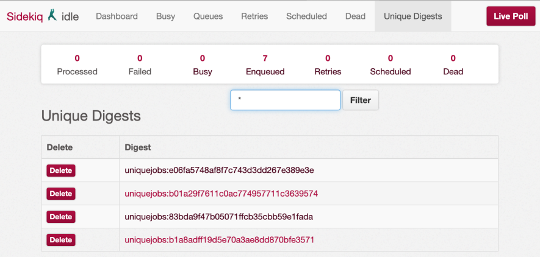
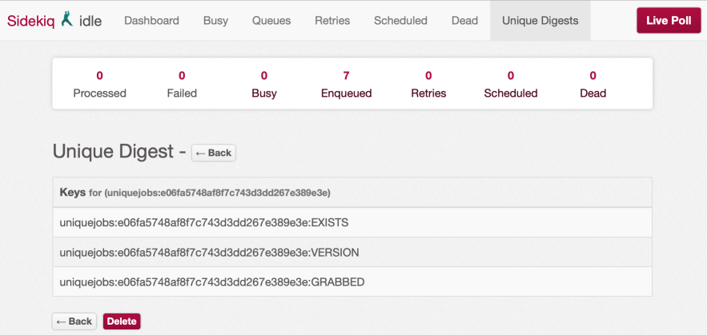

# SidekiqUniqueJobs [](https://gitter.im/mhenrixon/sidekiq-unique-jobs?utm_source=badge&utm_medium=badge&utm_campaign=pr-badge&utm_content=badge) [](https://travis-ci.org/mhenrixon/sidekiq-unique-jobs) [](https://codeclimate.com/github/mhenrixon/sidekiq-unique-jobs) [](https://codeclimate.com/github/mhenrixon/sidekiq-unique-jobs/coverage)

<!-- MarkdownTOC -->

- [Introduction](#introduction)
- [Documentation](#documentation)
- [Requirements](#requirements)
  - [ActiveJob](#activejob)
  - [redis-namespace](#redis-namespace)
- [Installation](#installation)
- [Support Me](#support-me)
- [General Information](#general-information)
- [Options](#options)
  - [Lock Expiration](#lock-expiration)
  - [Lock Timeout](#lock-timeout)
  - [Unique Across Queues](#unique-across-queues)
  - [Unique Across Workers](#unique-across-workers)
- [Locks](#locks)
  - [Until Executing](#until-executing)
  - [Until Executed](#until-executed)
  - [Until Timeout](#until-timeout)
  - [Unique Until And While Executing](#unique-until-and-while-executing)
  - [While Executing](#while-executing)
- [Conflict Strategy](#conflict-strategy)
  - [Log](#log)
  - [Raise](#raise)
  - [Reject](#reject)
  - [Replace](#replace)
  - [Reschedule](#reschedule)
- [Usage](#usage)
  - [Finer Control over Uniqueness](#finer-control-over-uniqueness)
  - [After Unlock Callback](#after-unlock-callback)
  - [Logging](#logging)
  - [Cleanup Dead Locks](#cleanup-dead-locks)
- [Debugging](#debugging)
  - [Sidekiq Web](#sidekiq-web)
    - [Show Unique Digests](#show-unique-digests)
    - [Show keys for digest](#show-keys-for-digest)
- [Communication](#communication)
- [Testing](#testing)
- [Contributing](#contributing)
- [Contributors](#contributors)

<!-- /MarkdownTOC -->

## Introduction

The goal of this gem is to ensure your Sidekiq jobs are unique. We do this by creating unique keys in Redis based on how you configure uniqueness.

## Documentation

This is the documentation for the master branch. You can find the documentation for each release by navigating to its tag: [v5.0.10][]

Below are links to the latest major versions (4 & 5):

- [v5.0.10][]
- [v4.0.18][]

## Requirements

See [Sidekiq requirements][] for what is required. Starting from 5.0.0 only sidekiq >= 4 and MRI >= 2.2. ActiveJob is not supported

### ActiveJob

Version 6 requires Redis >= 3 and pure Sidekiq, no ActiveJob supported anymore. See [About ActiveJob](https://github.com/mhenrixon/sidekiq-unique-jobs/wiki/About-ActiveJob) for why. It simply is too complex and generates more issues than I can handle given how little timer I have to spend on this project.

### redis-namespace

Will not be officially supported anymore. Since Mike [won't support redis-namespace](https://github.com/mperham/sidekiq/issues/3366#issuecomment-284270120) neither will I.

[Read this](http://www.mikeperham.com/2017/04/10/migrating-from-redis-namespace/) for how to migrate away from namespacing.

## Installation

Add this line to your application's Gemfile:

```
gem 'sidekiq-unique-jobs'
```

And then execute:

```
bundle
```

Or install it yourself as:

```
gem install sidekiq-unique-jobs
```

## Support Me

Want to show me some ❤️ for the hard work I do on this gem? You can use the following [PayPal link][]. Any amount is welcome and let me tell you it feels good to be appreciated. Even a dollar makes me super excited about all of this.

## General Information

See [Interaction w/ Sidekiq](https://github.com/mhenrixon/sidekiq-unique-jobs/wiki/How-this-gem-interacts-with-Sidekiq) on how the gem interacts with Sidekiq.

See [Locking & Unlocking](https://github.com/mhenrixon/sidekiq-unique-jobs/wiki/Locking-&-Unlocking) for an overview of the differences on when the various lock types are locked and unlocked.

## Options

### Lock Expiration

Lock expiration is used for two things. For the `UntilExpired` job releases the lock upon expiry. This is done from the client.

Since v6.0.11 the other locks will expire after the server is done processing.

```ruby
sidekiq_options lock_expiration: nil # default - don't expire keys
sidekiq_options lock_expiration: 20.days.to_i # expire this lock in 20 days
```

### Lock Timeout

This is the timeout (how long to wait) when creating the lock. By default we don't use a timeout so we won't wait for the lock to be created. If you want it is possible to set this like below.

```ruby
sidekiq_options lock_timeout: 0 # default - don't wait at all
sidekiq_options lock_timeout: 5 # wait 5 seconds
sidekiq_options lock_timeout: nil # lock indefinitely, this process won't continue until it gets a lock. VERY DANGEROUS!!
```

### Unique Across Queues

This configuration option is slightly misleading. It doesn't disregard the queue on other jobs. Just on itself, this means that a worker that might schedule jobs into multiple queues will be able to have uniqueness enforced on all queues it is pushed to.

```ruby
class Worker
  include Sidekiq::Worker

  sidekiq_options unique_across_queues: true, queue: 'default'

  def perform(args); end
end
```

Now if you push override the queue with `Worker.set(queue: 'another').perform_async(1)` it will still be considered unique when compared to `Worker.perform_async(1)` (that was actually pushed to the queue `default`).

### Unique Across Workers

This configuration option is slightly misleading. It doesn't disregard the worker class on other jobs. Just on itself, this means that a worker that the worker class won't be used for generating the unique digest. The only way this option really makes sense is when you want to have uniqueness between two different worker classes.

```ruby
class WorkerOne
  include Sidekiq::Worker

  sidekiq_options unique_across_workers: true, queue: 'default'

  def perform(args); end
end

class WorkerTwo
  include Sidekiq::Worker

  sidekiq_options unique_across_workers: true, queue: 'default'

  def perform(args); end
end


WorkerOne.perform_async(1)
# => 'the jobs unique id'

WorkerTwo.perform_async(1)
# => nil because WorkerOne just stole the lock
```

## Locks

### Until Executing

Locks from when the client pushes the job to the queue. Will be unlocked before the server starts processing the job.

**NOTE** this is probably not so good for jobs that shouldn't be running simultaneously (aka slow jobs).

```ruby
sidekiq_options lock: :until_executing
```

### Until Executed

Locks from when the client pushes the job to the queue. Will be unlocked when the server has successfully processed the job.

```ruby
sidekiq_options lock: :until_executed
```

### Until Timeout

Locks from when the client pushes the job to the queue. Will be unlocked when the specified timeout has been reached.

```ruby
sidekiq_options lock: :until_expired
```

### Unique Until And While Executing

Locks when the client pushes the job to the queue. The queue will be unlocked when the server starts processing the job. The server then goes on to creating a runtime lock for the job to prevent simultaneous jobs from being executed. As soon as the server starts processing a job, the client can push the same job to the queue.

```ruby
sidekiq_options lock: :until_and_while_executing
```

### While Executing

With this lock type it is possible to put any number of these jobs on the queue, but as the server pops the job from the queue it will create a lock and then wait until other locks are done processing. It _looks_ like multiple jobs are running at the same time but in fact the second job will only be waiting for the first job to finish.

**NOTE** Unless this job is configured with a `lock_timeout: nil` or `lock_timeout: > 0` then all jobs that are attempted to be executed will just be dropped without waiting.

```ruby
sidekiq_options lock: :while_executing, lock_timeout: nil
```

There is an example of this to try it out in the `rails_example` application. Run `foreman start` in the root of the directory and open the url: `localhost:5000/work/duplicate_while_executing`.

In the console you should see something like:

```
0:32:24 worker.1 | 2017-04-23T08:32:24.955Z 84404 TID-ougq4thko WhileExecutingWorker JID-400ec51c9523f41cd4a35058 INFO: start
10:32:24 worker.1 | 2017-04-23T08:32:24.956Z 84404 TID-ougq8csew WhileExecutingWorker JID-8d6d9168368eedaed7f75763 INFO: start
10:32:24 worker.1 | 2017-04-23T08:32:24.957Z 84404 TID-ougq8crt8 WhileExecutingWorker JID-affcd079094c9b26e8b9ba60 INFO: start
10:32:24 worker.1 | 2017-04-23T08:32:24.959Z 84404 TID-ougq8cs8s WhileExecutingWorker JID-9e197460c067b22eb1b5d07f INFO: start
10:32:24 worker.1 | 2017-04-23T08:32:24.959Z 84404 TID-ougq4thko WhileExecutingWorker JID-400ec51c9523f41cd4a35058 WhileExecutingWorker INFO: perform(1, 2)
10:32:34 worker.1 | 2017-04-23T08:32:34.964Z 84404 TID-ougq4thko WhileExecutingWorker JID-400ec51c9523f41cd4a35058 INFO: done: 10.009 sec
10:32:34 worker.1 | 2017-04-23T08:32:34.965Z 84404 TID-ougq8csew WhileExecutingWorker JID-8d6d9168368eedaed7f75763 WhileExecutingWorker INFO: perform(1, 2)
10:32:44 worker.1 | 2017-04-23T08:32:44.965Z 84404 TID-ougq8crt8 WhileExecutingWorker JID-affcd079094c9b26e8b9ba60 WhileExecutingWorker INFO: perform(1, 2)
10:32:44 worker.1 | 2017-04-23T08:32:44.965Z 84404 TID-ougq8csew WhileExecutingWorker JID-8d6d9168368eedaed7f75763 INFO: done: 20.009 sec
10:32:54 worker.1 | 2017-04-23T08:32:54.970Z 84404 TID-ougq8cs8s WhileExecutingWorker JID-9e197460c067b22eb1b5d07f WhileExecutingWorker INFO: perform(1, 2)
10:32:54 worker.1 | 2017-04-23T08:32:54.969Z 84404 TID-ougq8crt8 WhileExecutingWorker JID-affcd079094c9b26e8b9ba60 INFO: done: 30.012 sec
10:33:04 worker.1 | 2017-04-23T08:33:04.973Z 84404 TID-ougq8cs8s WhileExecutingWorker JID-9e197460c067b22eb1b5d07f INFO: done: 40.014 sec
```

## Conflict Strategy

Decides how we handle conflict. We can either reject the job to the dead queue or reschedule it. Both are useful for jobs that absolutely need to run and have been configured to use the lock `WhileExecuting` that is used only by the sidekiq server process.

The last one is log which can be be used with the lock `UntilExecuted` and `UntilExpired`. Now we write a log entry saying the job could not be pushed because it is a duplicate of another job with the same arguments

### Log

This strategy is intended to be used with `UntilExecuted` and `UntilExpired`. It will log a line about that this is job is a duplicate of another.

`sidekiq_options lock: :until_executed, on_conflict: :log`

### Raise

This strategy is intended to be used with `WhileExecuting`. Basically it will allow us to let the server process crash with a specific error message and be retried without messing up the Sidekiq stats.

`sidekiq_options lock: :while_executing, on_conflict: :raise, retry: 10`

### Reject

This strategy is intended to be used with `WhileExecuting` and will push the job to the dead queue on conflict.

`sidekiq_options lock: :while_executing, on_conflict: :reject`

### Replace

This strategy is intended to be used with client locks like `UntilExecuted`.
It will delete any existing job for these arguments from retry, schedule and
queue and retry the lock again.

This is slightly dangerous and should probably only be used for jobs that are
always scheduled in the future. Currently only attempting to retry one time.

`sidekiq_options lock: :until_executed, on_conflict: :replace`

### Reschedule

This strategy is intended to be used with `WhileExecuting` and will delay the job to be tried again in 5 seconds. This will mess up the sidekiq stats but will prevent exceptions from being logged and confuse your sysadmins.

`sidekiq_options lock: :while_executing, on_conflict: :reschedule`

## Usage

All that is required is that you specifically set the sidekiq option for _unique_ to a valid value like below:

```ruby
sidekiq_options lock: :while_executing
```

Requiring the gem in your gemfile should be sufficient to enable unique jobs.

### Finer Control over Uniqueness

Sometimes it is desired to have a finer control over which arguments are used in determining uniqueness of the job, and others may be _transient_. For this use-case, you need to define either a `unique_args` method, or a ruby proc.

The unique_args method need to return an array of values to use for uniqueness check.

The method or the proc can return a modified version of args without the transient arguments included, as shown below:

```ruby
class UniqueJobWithFilterMethod
  include Sidekiq::Worker
  sidekiq_options lock: :until_and_while_executing,
                  unique_args: :unique_args # this is default and will be used if such a method is defined

  def self.unique_args(args)
    [ args[0], args[2][:type] ]
  end

  ...

end

class UniqueJobWithFilterProc
  include Sidekiq::Worker
  sidekiq_options lock: :until_executed,
                  unique_args: ->(args) { [ args.first ] }

  ...

end
```

It is also quite possible to ensure different types of unique args based on context. I can't vouch for the below example but see [#203](https://github.com/mhenrixon/sidekiq-unique-jobs/issues/203) for the discussion.

```ruby
class UniqueJobWithFilterMethod
  include Sidekiq::Worker
  sidekiq_options lock: :until_and_while_executing, unique_args: :unique_args

  def self.unique_args(args)
    if Sidekiq::ProcessSet.new.size > 1
      # sidekiq runtime; uniqueness for the object (first arg)
      args.first
    else
      # queuing from the app; uniqueness for all params
      args
    end
  end
end
```

### After Unlock Callback

If you need to perform any additional work after the lock has been released you can provide an `#after_unlock` instance method. The method will be called when the lock has been unlocked. Most times this means after yield but there are two exceptions to that.

**Exception 1:** UntilExecuting unlocks and calls back before yielding.
**Exception 2:** UntilExpired expires eventually, no after_unlock hook is called.

```ruby
class UniqueJobWithFilterMethod
  include Sidekiq::Worker
  sidekiq_options lock: :while_executing,

  def after_unlock
   # block has yielded and lock is released
  end
  ...
end.
```

### Logging

To see logging in sidekiq when duplicate payload has been filtered out you can enable on a per worker basis using the sidekiq options. The default value is false

```ruby
class UniqueJobWithFilterMethod
  include Sidekiq::Worker
  sidekiq_options lock: :while_executing,
                  log_duplicate_payload: true

  ...

end
```

### Cleanup Dead Locks

For sidekiq versions before 5.1 a `sidekiq_retries_exhausted` block is required per worker class. This is deprecated in Sidekiq 6.0

```ruby
class MyWorker
  sidekiq_retries_exhausted do |msg, _ex|
    SidekiqUniqueJobs::Digests.del(digest: msg['unique_digest']) if msg['unique_digest']
  end
end
```

Starting in v5.1, Sidekiq can also fire a global callback when a job dies:

```ruby
# this goes in your initializer
Sidekiq.configure_server do |config|
  config.death_handlers << ->(job, _ex) do
    SidekiqUniqueJobs::Digests.del(digest: job['unique_digest']) if job['unique_digest']
  end
end
```

## Debugging

There are several ways of removing keys that are stuck. The prefered way is by using the unique extension to `Sidekiq::Web`. The old console and command line versions still work but might be deprecated in the future. It is better to search for the digest itself and delete the keys matching that digest.

### Sidekiq Web

To use the web extension you need to require it in your routes.

```ruby
# app/config/routes.rb
require 'sidekiq_unique_jobs/web'
mount Sidekiq::Web, at: '/sidekiq'
```

There is no need to `require 'sidekiq/web'` since `sidekiq_unique_jobs/web`
already does this.

To filter/search for keys we can use the wildcard `*`. If we have a unique digest `'uniquejobs:9e9b5ce5d423d3ea470977004b50ff84` we can search for it by enter `*ff84` and it should return all digests that end with `ff84`.

#### Show Unique Digests



#### Show keys for digest



## Communication

There is a [](https://gitter.im/mhenrixon/sidekiq-unique-jobs?utm_source=badge&utm_medium=badge&utm_campaign=pr-badge&utm_content=badge) for praise or scorn. This would be a good place to have lengthy discuss or brilliant suggestions or simply just nudge me if I forget about anything.

## Testing

This has been probably the most confusing part of this gem. People get really confused with how unreliable the unique jobs have been. I there for decided to do what Mike is doing for sidekiq enterprise. Read the section about unique jobs.

[Enterprise unique jobs][]

```ruby
SidekiqUniqueJobs.configure do |config|
  config.enabled = !Rails.env.test?
end
```

If you truly wanted to test the sidekiq client push you could do something like below. Note that it will only work for the jobs that lock when the client pushes the job to redis (UntilExecuted, UntilAndWhileExecuting and UntilExpired).

```ruby
RSpec.describe Workers::CoolOne do
  before do
    SidekiqUniqueJobs.config.enabled = false
  end

  # ... your tests that don't test uniqueness

  context 'when Sidekiq::Testing.disabled?' do
    before do
      Sidekiq::Testing.disable!
      Sidekiq.redis(&:flushdb)
    end

    after do
      Sidekiq.redis(&:flushdb)
    end

    it 'prevents duplicate jobs from being scheduled' do
      SidekiqUniqueJobs.use_config(enabled: true) do
        expect(described_class.perform_in(3600, 1)).not_to eq(nil)
        expect(described_class.perform_async(1)).to eq(nil)
      end
    end
  end
end
```

I would strongly suggest you let this gem test uniqueness. If you care about how the gem is integration tested have a look at the following specs:

- [spec/integration/sidekiq_unique_jobs/lock/until_and_while_executing_spec.rb](https://github.com/mhenrixon/sidekiq-unique-jobs/blob/master/spec/integration/sidekiq_unique_jobs/lock/until_and_while_executing_spec.rb)
- [spec/integration/sidekiq_unique_jobs/lock/until_executed_spec.rb](https://github.com/mhenrixon/sidekiq-unique-jobs/blob/master/spec/integration/sidekiq_unique_jobs/lock/until_executed_spec.rb)
- [spec/integration/sidekiq_unique_jobs/lock/until_expired_spec.rb](https://github.com/mhenrixon/sidekiq-unique-jobs/blob/master/spec/integration/sidekiq_unique_jobs/lock/until_expired_spec.rb)
- [spec/integration/sidekiq_unique_jobs/lock/while_executing_reject_spec.rb](https://github.com/mhenrixon/sidekiq-unique-jobs/blob/master/spec/integration/sidekiq_unique_jobs/lock/while_executing_reject_spec.rb)
- [spec/integration/sidekiq_unique_jobs/lock/while_executing_spec.rb](https://github.com/mhenrixon/sidekiq-unique-jobs/blob/master/spec/integration/sidekiq_unique_jobs/lock/while_executing_spec.rb)

## Contributing

1. Fork it
1. Create your feature branch (`git checkout -b my-new-feature`)
1. Commit your changes (`git commit -am 'Add some feature'`)
1. Push to the branch (`git push origin my-new-feature`)
1. Create new Pull Request

## Contributors

You can find a list of contributors over on [Contributors][]

[v5.0.10]: https://github.com/mhenrixon/sidekiq-unique-jobs/tree/v5.0.10.
[v4.0.18]: https://github.com/mhenrixon/sidekiq-unique-jobs/tree/v4.0.18
[Sidekiq requirements]: https://github.com/mperham/sidekiq#requirements
[Enterprise unique jobs]: https://www.dailydrip.com/topics/sidekiq/drips/sidekiq-enterprise-unique-jobs
[Contributors]: https://github.com/mhenrixon/sidekiq-unique-jobs/graphs/contributors
[Paypal link https://paypal.me/mhenrixon]: https://paypal.me/mhenrixon
